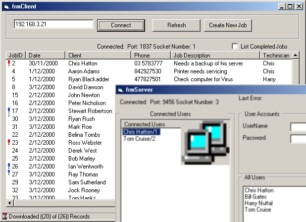



## Access Ado Database Remotely via Winsock Control

### Description

Heres a good example of using a winsock control to access a ADO database over a network/dialup connection. You will be able to access the database fully, with Add/Delete, Read/Write access. Also i have inbedded authentication against the database via the winsock control.

This program is simply for basic job tracking, from inhouse, and for remote access areas.

Bascially how this works, It sends the server a few commands/strings, and the server generates the sql statement and sends back the results, to the client winsock application, it then recieves the information and displays it out into a listview control with columns.

----

If you like the code please vote!
 
### More Info
 
If anyone can share with me any Winsock API code with multi connections, i'll be happy to rewrite another program like this using only API.

email me @ chris@hatton.com

Multi connections to the winsock server, doesn't work that well. if you get it running successfully please email me and tell me what you did.

             |
---                |---
**Submitted On**   |2000-12-03 19:56:34
**By**             |[Chris Hatton](https://github.com/Planet-Source-Code/PSCIndex/blob/master/ByAuthor/chris-hatton.md)
**Level**          |Intermediate
**User Rating**    |4.8 (422 globes from 88 users)
**Compatibility**  |VB 4\.0 \(16\-bit\), VB 4\.0 \(32\-bit\), VB 5\.0, VB 6\.0, VBA MS Access
**Category**       |[Databases/ Data Access/ DAO/ ADO](https://github.com/Planet-Source-Code/PSCIndex/blob/master/ByCategory/databases-data-access-dao-ado__1-6.md)
**World**          |[Visual Basic](https://github.com/Planet-Source-Code/PSCIndex/blob/master/ByWorld/visual-basic.md)
**Archive File**   |[CODE\_UPLOAD122831232000\.zip](https://github.com/Planet-Source-Code/chris-hatton-access-ado-database-remotely-via-winsock-control__1-13281/archive/master.zip)

